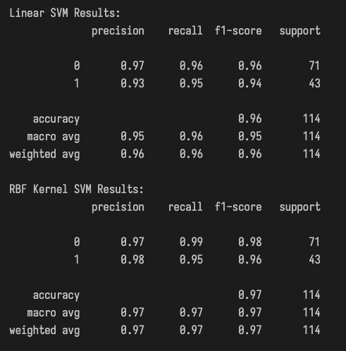
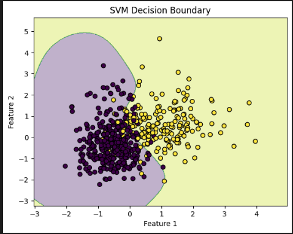

# AI & ML Internship - Task 7: Support Vector Machines (SVM)

The goal of this task was to use Support Vector Machines (SVMs) for binary classification on the breast cancer dataset using both linear and non-linear (RBF kernel) approaches.

1. **Data Preparation**
   - Loaded and cleaned the breast cancer dataset.
   - Dropped non-feature columns (`id`), and used `diagnosis` as the label.
   - Encoded labels (`B` → 0, `M` → 1).

2. **Model Training**
   - Trained two SVM models:
     - **Linear Kernel**
     - **RBF Kernel (non-linear)**

3. **Hyperparameter Tuning**
   - Performed **GridSearchCV** with cross-validation.
   - Tuned `C` and `gamma` for the RBF kernel.

4. **Evaluation**
   - Compared both models using classification metrics and cross-validation accuracy.
   - Visualized the decision boundary for 2D projected data.

## Results

| Metric                    | Value                        |
| ------------------------- | ---------------------------- |
| Cross-validation Accuracy | **0.9736**                   |
| Best Parameters (RBF)     | `{'C': 1, 'gamma': 'scale'}` |
| Best CV Score             | **0.9736**                   |

## Visual Results

- **Model Performance (Linear & RBF)**  
  

- **SVM Decision Boundary (RBF Kernel)**  
  

## Tools & Libraries
Python, Scikit-learn, NumPy, Matplotlib, Pandas
